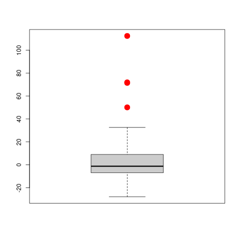

  
# Summary

Additive models provide an alternative to fully unspecified
non-parametric regression models. They are flexible and are not affected by
the curse of dimensionality when many explanatory variables are present. They
also allow the user to explore the individual effect of each covariate on the
overall mean function, and thus provide similar interpretations to those
obtained with linear models while remaining non-parametric in nature. Standard
algorithms to fit additive models are known to be highly susceptible to the
presence of a few atypical or outlying observations in the data.

``RBF`` [@RBF] is an R package that implements a
kernel-based robust regression estimator for additive models using a backfitting algorithm.

<!--``Gala`` was designed to be used by both astronomical researchers and by
students in courses on gravitational dynamics or astronomy. It has already been
used in a number of scientific publications [@Pearson:2017] and has also been
used in graduate courses on Galactic dynamics to, e.g., provide interactive
visualizations of textbook material [@Binney:2008]. The combination of speed,
design, and support for Astropy functionality in ``Gala`` will enable exciting
scientific explorations of forthcoming data releases from the *Gaia* mission
[@gaia] by students and experts alike. The source code for ``Gala`` has been
archived to Zenodo with the linked DOI: [@zenodo]-->


# Statement of Need

The purpose of ``RBF`` is to:

 * Provide a kernel-based estimation procedure for additive models.
 
 * Allow the user to estimate using a robust procedure in order to avoid problems that come from atypical observations in the data.

# Implementation Goals

``RBF`` has an interface for the user similar to the most widely used R packages to fit additive models: ``gam`` [@gam], ``mgcv`` [@mgcv], ``gamlss`` [@gamlss] and ``VGAM`` [@VGAM], among others. Besides, similar S3 methods for a better used such as ``plot``, ``predict``, ``fitted values``, ``summary``, ``print``, ``deviance`` and ``residuals``, have been developed.

# Background

Nonparametric regression models provide an alternative to parametric regression models such as linear regression models that require fewer and weaker assumptions  for the corresponding analysis to be correct.  In what follows we will assume that 
$(\textbf{X}_i^\top,Y_i)^\top$, $1\leq i\leq n$, are independent and identically
distributed random vectors with the same distribution as $(\textbf{X}^\top,Y)^\top$,
$\textbf{X}\in\mathbb{R}^d$, $Y\in\mathbb{R}$, satisfying the following nonparametric
regression model:
$$
Y \ = \ g(\textbf{X}) \, + \, \epsilon \, ,
$$
where the error $\epsilon$ is independent from $\textbf{X}$ and
$g:\mathbb{R}^d\to\mathbb{R}$ is the unknown regression function to be estimated. Without additional assumptions, fitting this model requires multivariate smoothing
techniques, which suffer from what is known in the literature as the *curse of dimensionality* [@Stone1985]. Intuitively, the problem is that
as the number of explanatory variables $d$ increases, neighbourhoods of a point
$\textbf{x} \in \mathbb{R}^d$ became more sparse.  This results in slower rates of
convergence for the regression function estimator.  For example, kernel-based estimators
have a convergence rate of $\sqrt{n \, h_n^d}$, where $h_n \to 0$ is the bandwidth or
smoothing parameter used for obtaining the estimator.  

@HastieTibshirani1990 introduce additive models as a 
non-parametric generalization of linear models. These models avoid the curse of dimensionality, and 
are flexible and interpretable.
They assume that the regression function can be decomposed as the sum of smooth
univariate functions, each of them depending on a single explanatory variable.
Specifically, 
additive models postulate that

\begin{equation} \label{eq:model} 
Y \ = \ \mu + \sum_{j=1}^d g_j(X_j) \, + \, \epsilon \, ,
\end{equation}

where the error $\epsilon$ is independent of $\textbf{X}$ and centered at zero.
The objects to be estimated are the location parameter $\mu \in \mathbb{R}$ and the
smooth functions $g_j \, : \, \mathbb{R} \to \mathbb{R}$. In order for the model to be
identifiable, one usually adds the conditions $E \left( g_j(X_j) \right)=0$,
$j=1, \ldots, d$. Note that when $g_j( X_j ) = \beta_j \, X_j$ for some
$\beta_j \in \mathbb{R}$, the above model reduces to the usual linear regression one. Similarly, the functions $g_j$ can be interpreted as the marginal effect
of the $j$-th covariate on the expected value of the response variable when all
other explanatory variables remain fixed.  Additive models combine the
flexibility of nonparametric models and the simple interpretation of linear
regression models.  A major advantage of these models is that the individual
functions can be estimated at an optimal univariate rate, regardless of the
number of available covariates @Stone1985. 

Several estimation procedures for additive models have been proposed in the
literature.  One of the most popular ones is the backfitting algorithm proposed by @FriedmanStuetzle1981 and discussed further in
@BujaHastieTibshirani1989. 
Noting that under model (\autoref{eq:model}) the additive components satisfy
$g_j(x) = E [ Y - \mu - \sum_{\ell \ne j} g_\ell(X_\ell) | X_j = x ]$, the
backfitting procedure iteratively computes estimates of each $g_j$ by smoothing
the partial residuals as functions of the observed values of $X_j$.


It is well known that these estimators can be seriously affected by a
relatively small proportion of atypical observations, and thus in many
practical applications robust estimating alternatives are desirable.  Recently,
@BoenteMartinezSalibian2017 proposed an outlier robust version of
backfitting, implemented in the ``RBF`` package. The intuitive idea consists of using the backfitting algorithm
with robust univariate smoothers, such as the kernel-based estimators in
@BoenteFraiman1989. This approach corresponds to finding the solution
to the following optimization problem:
\begin{equation} \label{rbf:min}
\min_{\mu, g_1, \ldots, g_d} E \left[ \, \rho \left( \frac{Y - \mu -
\sum_{j=1}^d g_j(X_j) }{\sigma} \right) \right] 
\end{equation}
over $\mu \in \mathbb{R}$ and functions $g_j$ with $E[g_j(X_j)] = 0$ and
$E[g_j^2(X_j)] < \infty$, where $\rho : \mathbb{R} \to \mathbb{R}$ is an even,
non-decreasing and non-negative loss function and $\sigma$ is the residual
scale. Typical choices for the loss function $\rho$ are Tukey's bisquare family
and Huber's loss @maronna2018robust.  Note that when $\rho(t) =
t^2$, this approach reduces to the classical backfitting.  Under standard
regularity conditions, the robust estimators in (\ref{rbf:min}) are consistent,
and the corresponding algorithm works very well in practice, as it will be appreciated in the following example.

# Illustration using the ``airquality`` data set

We consider the ``airquality`` data set available in R which
contains 153 daily air quality measurements in the New York region between May and September, 1973 (see @ChambersClevelandKleinerTukey1983). The interest is in explaining the mean Ozone concentration (\lq\lq
$\mbox{O}_3$\rq\rq, measured in ppb) as a function of 3 potential explanatory
variables: solar radiance measured in the frequency band
4000-7700 (\lq\lq Solar.R\rq\rq, in Langleys), wind speed
(\lq\lq Wind\rq\rq, in mph) and temperature (\lq\lq Temp\rq\rq, in degrees Fahrenheit). In our analysis we focus on the
111 complete cases in the data set. 

Figure \autoref{fig:scatterplot} shows the scatter plot of the data which indicates that the 
relationship between ozone and other variables does not appear to be linear.

<!-- <center></center> -->

<!-- <p align="center">
 
    <br>
    <em>Figure 1: Scatter plot of variables of the Air Quality data set.</em>
</p>
-->


<!--
<center>  
-->

<!-- 
-->

<!--{fig:scatterplot}{Scatter plot of variables of the Air Quality data set.}-->

We propose to fit an additive model of the form 
\begin{equation}\label{eq:ozone-model}
\mbox{Ozone}=\mu+g_{1}(\mbox{Solar.R})+g_{2}(\mbox{Wind})+g_{3}(\mbox{Temp}) + \varepsilon \, .
\end{equation} 
Based on the results of the simulation study reported in
@BoenteMartinezSalibian2017, we will use robust smoothers with local
linear kernel estimates and Tukey's bisquare loss function. These choices can
be  set in the call to the function ``backf.rob`` using the arguments
``degree = 1`` and ``type='Tukey'``. For the tuning constant of the
$\rho$ function we use its default value ``k.t = 4.685``, which corresponds
to a linear regression estimator with 95\% efficiency when errors are Gaussian.
This choice provides a good balance between robustness and efficiency. 
We specify the response and explanatory variables with the 
formula notation that is usual in R. 
The code below computes the robust backfitting estimator 
for the ``airquality`` data, restricting the analysis 
to cases that do not contain missing entries using 
the argument ``subset``: 

```
R> data(airquality)
R> library(RBF)
R> ccs <- complete.cases(airquality)
R> fit.full <- backf.rob(Ozone ~ Solar.R + Wind + Temp, windows=bandw, 
                   epsilon=1e-6, degree=1, type='Tukey', 
                   subset = ccs, data=airquality)
```
Convergence of the iterative backfitting algorithm is controlled using the
arguments ``epsilon`` (maximum acceptable relative absolute difference
between consecutive estimates $\hat{g}_j$) and \code{max.it} (maximum number of
iterations). 

The argument ``windows`` is a vector of $d$ bandwidths (in our case $d = 3$)
to be used with the kernel smoothers of each explanatory variable.  To select
the bandwidths of the smoothers (in the vector ``bandw`` above) we consider
a 3 dimensional grid, where the possible bandwidths for each variable are:
$\hat{\sigma}_j / 2$,  $\hat{\sigma}_j$, $1.5 \, \hat{\sigma}_j$, $2 \hat{\sigma}_j$,
$2.5 \, \hat{\sigma}_j$ and $3 \, \hat{\sigma}_j$, and $\hat{\sigma}_j$ is the
standard deviation of the $j$-th explanatory variable.
This corresponds to a search over 216 possible combinations of bandwidths.  For
each of these vectors of 3 bandwidths we used 
leave-one-out combined with the robust cross-validation criterion in
(\autoref{eq:robustcv}).

We obtained the following optimal triplet:
```
R> bandw <- c(136.7285, 10.67314, 4.764985)
```
 

To visualize the estimated smooth components in model (\autoref{eq:ozone-model}),
we generate plots of partial residuals using the ``plot`` method. The
argument ``which`` specifies the desired component to be displayed.  For
example, to obtain the plot of the partial residuals associated with the first
additive component $g_1$, we use
```
R> plot(fit.full, which=1)
```
Similarly, the other partial residual
plots can be obtained setting the argument ``which`` to the indices of the desired components (e.g. 
``which = c(1, 3)``). By default all partial residual plots are displayed. 
Figure \autoref{fig:ozone-full} shows the plots of the 3 partial residuals and the
corresponding estimated additive components of the model. 


<!--
<center>  
 
 
</center>
-->

<!--
\begin{figure}[t]
\begin{center}
\subfigure[Robust $\hat{g}_1$]{\includegraphics[width=0.3\textwidth]{Figure-ozone-full-g3.pdf}}
\subfigure[Robust $\hat{g}_2$]{\includegraphics[width=0.3\textwidth]{Figure-ozone-full-g2.pdf}}
\subfigure[Robust $\hat{g}_3$]{\includegraphics[width=0.3\textwidth]{Figure-ozone-full-g1.pdf}}   
\end{center}
\vskip-0.2in 
\caption{\label{fig:ozone-full}{Plots of partial residuals and estimated curve for each additive 
function using the robust backfitting procedure.}}
\end{figure}
-->

To detect potentially atypical observations in the data, we construct a boxplot
of the residuals, and highlight in red those residuals that are unusually
large.  In addition to displaying the boxplot, we use the function
``boxplot`` to also identify outlying residuals as shown in the code below.
Residuals and fitted values over the sample can be extracted from the fit
object using the methods ``predict`` and ``residuals``.  The code below
was used to generate Figure \autoref{fig:ozone-boxplot} that shows the resulting
boxplot with 4 observations detected as outliers highlighted in red. These
correspond to observations 23, 34, 53 and 77.
```
R> re.ro <- residuals(fit.full)
R> ou.ro <- boxplot(re.ro, col='gray80')$out
R> in.ro <- (1:length(re.ro))[ re.ro %in% ou.ro ]
R> points(rep(1, length(in.ro)), re.ro[in.ro], pch=20, cex=1.5, col='red')
```

<!--
<center>  
</center>
-->


<!--
\begin{figure}[t]
\begin{center}
\includegraphics[width=0.5\textwidth]{Figure-ozone-boxplot.pdf} 
\end{center}
\vskip-0.4in 
\caption{\label{fig:ozone-boxplot}{Boxplot of the residuals obtained using the
	robust fit.  }}
\end{figure}
-->

In Figure \autoref{fig:ozone-scat-h} we use red points to identify the 
potential outliers in the scatter plot of the data.  Note that not all these
suspected atypical observations are particularly extreme, or directly evident
on the scatter plot. However, as we show below, they do have an important
effect on the estimates of the components of the additive model. 


<!--
<center> 
</center>
-->

<!--
\begin{figure}[t]
\begin{center}
\includegraphics[width=0.8\textwidth]{Figure-ozone-scat-h.pdf} 
\end{center}
\vskip-0.4in 
\caption{\label{fig:ozone-scat-h}{Scatter plot of the partial residuals
	obtained with the robust fit and with the outliers highlighted in
	red.}}
\end{figure}
-->

It is often informative to compare the robust and classical fits. Here we use
the R package ``gam`` that implements the classical backfitting
algorithm with local regression smoothers. We ran a similar leave-one-out
cross-validation experiment to select the spans for each the 3 univariate
smoothers. Mimicking the bandwidth search done for the robust backfitting
estimator, we considered 7 possible span values for each explanatory variable:
0.3, 0.4, 0.5, \ldots, 0.9. Using the optimal values we compute the
non-robust fit with the following lines:

```
R> data(airquality)
R> dd <- airquality
R> dd <- dd[complete.cases(dd), c('Ozone', 'Solar.R', 'Wind', 'Temp')]
R> library(gam)
R> fit.gam <- gam(Ozone ~ lo(Solar.R, span=.7) + lo(Wind, span=.7) + 
                  lo(Temp, span=.5), data=dd)
```

The panels in Figure \autoref{fig:ozone-res-h} contain the partial residuals plots and both sets of estimated functions (robust and non-robust).
The potential outliers identified with the robust fit are highlighted in red. The main differences between the two fits 
are in the estimated effects of wind speed and temperature. In particular, the classical estimate for $\hat{g}_1(\mbox{Temp})$
yields a consistently lower effect on mean Ozone than the robust counterpart 
for moderate-to-high temperatures (85 degrees and higher). In the case of wind speed, the non-robust estimate 
$\hat{g}_2(\mbox{Wind})$ indicates a higher effect
of wind speed over Ozone concentrations
for low speeds than the one given by the robust estimate, and
the opposite difference for higher speeds. 


<!--
<center>  
 
 
</center>
-->

<!--
\begin{figure}[t]
\begin{center}
\subfigure[Robust and classical $\hat{g}_1$]{\includegraphics[width=0.3\textwidth]{Figure-ozone-res-h-g3.pdf}}
\subfigure[Robust and classical $\hat{g}_2$]{\includegraphics[width=0.3\textwidth]{Figure-ozone-res-h-g2.pdf}}
\subfigure[Robust and classical $\hat{g}_3$]{\includegraphics[width=0.3\textwidth]{Figure-ozone-res-h-g1.pdf}}
\end{center}
\vskip-0.2in 
\caption{\label{fig:ozone-res-h}{Plots of partial residuals with the robust backfitting fit, the estimated curves with the classical (in magenta) and robust (in blue) procedures. The potential outliers are highlighted in red.
\end{figure}
-->

To verify that the main differences between the robust and non-robust backfitting 
estimators are due to the possible outliers, we repeated the classical analysis without them. 
Figure \autoref{fig:ozone-out} shows the estimated curves obtained with the classical estimator 
using the \lq\lq clean\rq\rq\, data together with the robust ones computed on the original data set. Note
that both fits are now very close. An intuitive interpretation is that the robust fit automatically
down-weighted potential outliers and produced estimates very similar to those obtained with the classical 
backfitting algorithm applied on the rest of the data.


<!--
<center>  
 
 
</center>
-->

<!--
\begin{figure}[t]
\begin{center}
\subfigure[Robust and classical $\hat{g}_1$]{\includegraphics[width=0.3\textwidth]{Figure-ozone-out-cla-rob-g3.pdf}}
\subfigure[Robust and classical $\hat{g}_2$]{\includegraphics[width=0.3\textwidth]{Figure-ozone-out-cla-rob-g2.pdf}}
\subfigure[Robust and classical $\hat{g}_3$]{\includegraphics[width=0.3\textwidth]{Figure-ozone-out-cla-rob-g1.pdf}}
\end{center}
\vskip-0.2in 
\caption{\label{fig:ozone-out}{Plots of estimated curves and partial residuals with the robust backfitting fit. In magenta, the estimated curves with the classical backfitting procedure without 
	potential outliers, and in blue the estimated curves with the robust approach. 
Red points correspond to the potential outliers. 
}}
\end{figure}
-->


# Acknowledgements

This research was partially supported by  20020170100022BA from the Universidad de Buenos Aires, PICT 2018-00740 from ANPCYT, Internal Projects from the Department of Basic Science CD-CBLUJ 301/19 and CD-CBLUJ 204/19 and Researchers in Training Project RESREC-LUJ 224/19, Universidad Nacional de Luján, Argentina.

# References
